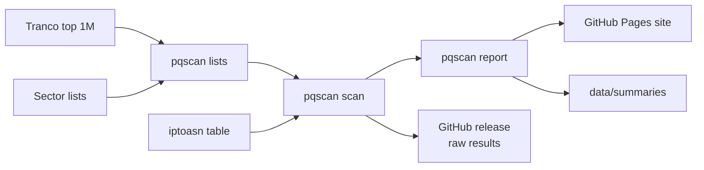

# pqscan-nl

**How quantum-safe is .nl? A weekly measurement of how many Dutch websites protect their visitors with post-quantum key exchange.**

[](https://github.com/JamievanRiel/pqscan-nl/actions/workflows/ci.yml)


**Results: https://jamievanriel.github.io/pqscan-nl/**

Traffic recorded today can be decrypted later if the key exchange that protected it is ever broken by a quantum computer. Hybrid post-quantum key exchanges such as X25519MLKEM768 close that gap, and current browsers already offer them. The question is which websites accept.

Every Monday, `pqscan` performs TLS handshakes with all `.nl` domains in the [Tranco top 1 million](https://tranco-list.eu/) (about 19,000) and with curated lists of Dutch banks, government bodies, hospitals and web shops. It publishes the results as a static site, a summary per scan and the raw data.

## What it measures

For each domain, `pqscan` connects to port 443 (the domain, or its `www.` host if that fails) and runs up to two handshakes:

1. A **default handshake** offering what a current browser offers: the hybrid groups X25519MLKEM768, SecP256r1MLKEM768 and SecP384r1MLKEM1024 plus classic groups.
2. Only if the server picked a classic group, a **support check** offering post-quantum groups only.

| Status | Meaning |
|---|---|
| `pq-default` | The default handshake used a post-quantum hybrid group |
| `pq-supported` | The server picked classic by default but completed the post-quantum-only handshake |
| `classic` | No post-quantum key exchange |
| `unreachable` | No TLS handshake completed; left out of all percentages |

Only handshakes are performed; no web pages are requested. See the [methodology](https://jamievanriel.github.io/pqscan-nl/methodology.html) for the limitations.

## How it works



A [GitHub Actions workflow](.github/workflows/scan.yml) runs the pipeline weekly. The scanner is plain Go with no dependencies outside the standard library.

## Try it

```sh
go install github.com/JamievanRiel/pqscan-nl/cmd/pqscan@latest
pqscan check rijksoverheid.nl nu.nl
```

Run the full pipeline locally:

```sh
curl -fsSLo top-1m.csv.zip https://tranco-list.eu/top-1m.csv.zip
curl -fsSLo tranco-id.txt https://tranco-list.eu/top-1m-id
curl -fsSLo ip2asn-v4.tsv.gz https://iptoasn.com/data/ip2asn-v4.tsv.gz
go build ./cmd/pqscan
./pqscan lists -o targets.jsonl
./pqscan scan -i targets.jsonl -o scan.jsonl
./pqscan report -scan scan.jsonl -tranco-id "$(cat tranco-id.txt)" -summaries "$(mktemp -d)" -site site
python3 -m http.server -d site
```

## Data

- **Raw results:** one JSON record per domain, attached to each [release](https://github.com/JamievanRiel/pqscan-nl/releases).
- **Summaries:** counts per status, sector and hosting network in [`data/summaries`](data/summaries).
- **Sector lists:** [`lists/sectors`](lists/sectors), every entry with its source. The government list is generated from the [Organisaties overheid](https://organisaties.overheid.nl/) register with `go run ./tools/govlist`.

## Opting out

To exclude a domain from future scans, [open an issue](https://github.com/JamievanRiel/pqscan-nl/issues). It will be added to [`lists/exclude.txt`](lists/exclude.txt).

## Related

[hybride-pq](https://github.com/JamievanRiel/hybride-pq) implements hybrid post-quantum signatures, encrypted channels and key storage in Python.

## License

MIT, see [LICENSE](LICENSE). Tranco data is used under its terms; the iptoasn.com table is public domain (PDDL).
