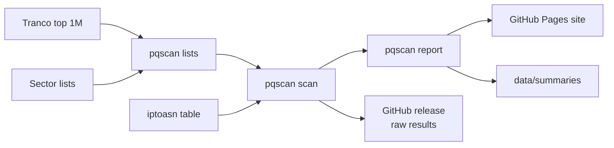

# pqscan-nl

**How quantum-safe is .nl? A weekly measurement of how many Dutch websites protect their visitors with post-quantum key exchange.**

[](https://github.com/JamievanRiel/pqscan-nl/actions/workflows/ci.yml)


**Results: https://jamievanriel.github.io/pqscan-nl/**

Traffic recorded today can be decrypted later if the key exchange that protected it is ever broken by a quantum computer. Hybrid post-quantum key exchanges close that gap, and current browsers already offer one: X25519MLKEM768. The question is which websites accept it.

Every Monday, `pqscan` performs TLS handshakes with all `.nl` domains in the [Tranco top 1 million](https://tranco-list.eu/) (about 19,000) and with curated lists of Dutch banks, government bodies, hospitals and web shops. It publishes the results as a static site, a summary per scan and the raw data.

## What it measures

For each domain, `pqscan` connects to port 443 (the domain, or its `www.` host if that fails) and runs up to two handshakes:

1. A **default handshake** offering what current browsers offer: the hybrid group X25519MLKEM768 plus the classic groups X25519, P-256 and P-384, over TLS 1.2 or 1.3.
2. Only if the server picked a classic group, a **support check** over TLS 1.3 offering all three hybrid groups (X25519MLKEM768, SecP256r1MLKEM768 and SecP384r1MLKEM1024) and nothing classic.

| Status | Meaning |
|---|---|
| `pq-default` | The default handshake used a post-quantum hybrid group |
| `pq-supported` | The server picked classic by default but completed the post-quantum-only handshake |
| `classic` | No post-quantum key exchange |
| `unreachable` | No TLS handshake completed; left out of all percentages |

The headline percentage, the trend and the hosting table cover the `.nl` domains in the Tranco top 250,000. The rest of the top 1 million is scanned too but shown separately: it contains thousands of similar, apparently generated domains on one network, which would otherwise dominate the figure.

Only handshakes are performed; no web pages are requested. See the [methodology](https://jamievanriel.github.io/pqscan-nl/methodology.html) for the limitations.

## How it works



A [GitHub Actions workflow](.github/workflows/scan.yml) runs the pipeline weekly. The scanner is plain Go with no dependencies outside the standard library.

This repository is private. The site, the raw results of the latest scan, the sector lists and the [opt-out repository](https://github.com/JamievanRiel/pqscan-nl-optout) are public.

## Try it

```sh
go run ./cmd/pqscan check rijksoverheid.nl nu.nl
```

Run the full pipeline locally:

```sh
curl -fsSLo top-1m.csv.zip https://tranco-list.eu/top-1m.csv.zip
curl -fsSLo tranco-id.txt https://tranco-list.eu/top-1m-id
curl -fsSLo ip2asn-v4.tsv.gz https://iptoasn.com/data/ip2asn-v4.tsv.gz
go build ./cmd/pqscan
./pqscan lists -o targets.jsonl
./pqscan scan -i targets.jsonl -o scan.jsonl
./pqscan report -scan scan.jsonl -tranco-id "$(cat tranco-id.txt)" -summaries "$(mktemp -d)" -site site
python3 -m http.server -d site
```

## Data

- **Raw results:** one JSON record per domain, attached to each [release](https://github.com/JamievanRiel/pqscan-nl/releases). The latest scan is also published on the site as `scan-YYYY-MM-DD.jsonl.gz`, linked from every page. `cert_valid` is `true` or `false` when a handshake completed (whether the certificate verifies against the system roots, which does not affect the status) and absent for unreachable domains.
- **Summaries:** counts per status, sector and hosting network in [`data/summaries`](data/summaries). `tranco_top` holds the headline counts for the domains ranked `tranco_top_rank` or better, `tranco` counts every Tranco domain.
- **Sector lists:** [`lists/sectors`](lists/sectors), every entry with its source, published on the site under `sectors/`. The government list is generated from the [Organisaties overheid](https://organisaties.overheid.nl/) register with `go run ./tools/govlist`, which also merges the hand-maintained entries in [`lists/government-extra.csv`](lists/government-extra.csv).

## Opting out

Because this repository is private, opt-out requests arrive as issues in the public [pqscan-nl-optout](https://github.com/JamievanRiel/pqscan-nl-optout/issues) repository, which the site links to. Add the domain to [`lists/exclude.txt`](lists/exclude.txt) and close the issue.

## Related

[hybride-pq](https://github.com/JamievanRiel/hybride-pq) implements hybrid post-quantum signatures, encrypted channels and key storage in Python.

## License

MIT, see [LICENSE](LICENSE). Tranco data is used under its terms; the iptoasn.com table is public domain (PDDL).
